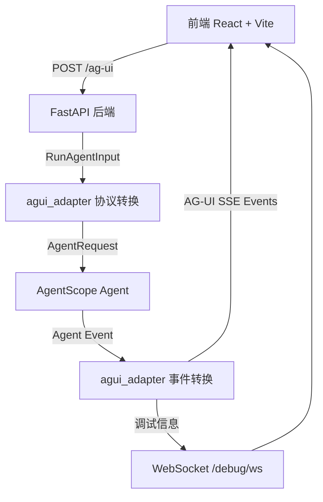
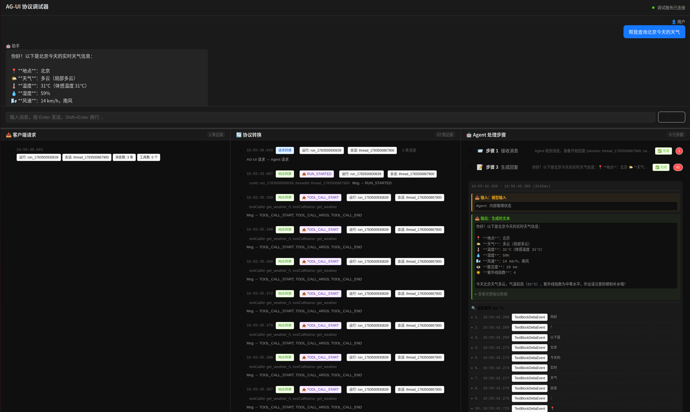

# AG-UI 协议调试器

一个独立的 AG-UI 协议调试与可视化系统，从零实现 AG-UI 协议兼容服务，并配套可视化调试界面。

---

## 项目概述

本项目旨在深入理解 AG-UI 协议的工作原理，通过独立实现完整的协议栈，并配套可视化界面展示协议的完整运行流程。

### 核心功能

1. **AG-UI 协议服务**：独立的 FastAPI 后端服务，完整实现 AG-UI 协议
   - 接收 `RunAgentInput` 请求
   - 驱动 agentscope Agent 运行
   - 返回 SSE 流式响应
   - 支持 WebSocket 调试信息推送

2. **可视化调试界面**：React 前端，展示协议运行全流程
   - **Chat 聊天界面**：与大模型交互
   - **调试监控面板**：三栏展示协议运行过程
     - 左栏：客户端发送的原始 JSON 请求
     - 中栏：AG-UI 协议 ↔ Agent 内部消息的双向转换
     - 右栏：Agent 内部运行事件（推理、工具调用、状态变化）

3. **协议转换可视化**：完整展示 AG-UI 协议的转换过程
   - 请求转换：`RunAgentInput` → `AgentRequest`
   - 响应转换：`Agent Event` → `AG-UI Events`
   - 字段映射：`threadId` → `session_id`，`runId` → `id` 等

---

## 架构图



---

## 演示



上图展示了 AG-UI 调试器的运行效果：上半部分为聊天界面，下半部分为三栏调试面板，可实时观察协议转换、Agent 事件和原始请求。

---

## 项目结构

```
ag_ui_debug/
├── README.md                    # 本文档
├── server/                      # 后端服务
│   ├── main.py                 # 入口：启动 Uvicorn
│   ├── app.py                  # FastAPI 应用构建
│   ├── agui_endpoint.py      # POST /ag-ui 端点（核心）
│   ├── agui_adapter.py       # AG-UI ↔ Agent 转换器（核心）
│   ├── agent_runner.py       # Agent 创建与运行
│   ├── debug_ws.py           # WebSocket 调试端点
│   ├── debug_publisher.py    # 调试信息发布
│   ├── requirements.txt       # 依赖声明
│   └── README.md             # 后端详细文档
└── web/                        # 前端界面
    ├── package.json           # 项目依赖
    ├── vite.config.ts         # Vite 配置（含代理）
    ├── tsconfig.json          # TypeScript 配置
    ├── index.html             # 入口 HTML
    └── src/
        ├── main.tsx           # React 挂载点
        ├── App.tsx            # 根组件（布局控制器）
        ├── App.css            # 全局样式（深色主题）
        ├── hooks/
        │   ├── useAguiSSE.ts   # AG-UI SSE 通信 Hook
        │   └── useDebugWS.ts   # WebSocket 调试连接 Hook
        ├── utils/
        │   ├── aguiClient.ts   # AG-UI 客户端工具
        │   └── jsonFormatter.ts # JSON 格式化工具
        └── components/
            ├── ChatPanel/      # 聊天界面
            │   ├── index.tsx
            │   ├── MessageList.tsx
            │   ├── MessageInput.tsx
            │   └── types.ts
            ├── DebugPanel/     # 调试监控面板（三栏）
            │   ├── index.tsx
            │   ├── ClientJsonView.tsx
            │   ├── AguiTransformView.tsx
            │   └── AgentInfoView.tsx
            └── SplitPane/      # 可调整分栏组件
                └── index.tsx
```

---

## 前后端框架

### 后端框架

| 技术 | 说明 |
|------|------|
| **FastAPI** | Web 框架，处理 HTTP 和 WebSocket 请求 |
| **Uvicorn** | ASGI 服务器，运行 FastAPI 应用 |
| **Pydantic** | 数据模型验证，用于 AG-UI 协议类型 |
| **agentscope** | Agent 框架，驱动 ReActAgent 运行 |
| **ag-ui-protocol** | AG-UI 协议包，提供协议类型定义 |
| **fakeredis** | 模拟 Redis，用于开发环境 session |

### 前端框架

| 技术 | 说明 |
|------|------|
| **React 18** | UI 框架，函数式组件 + Hooks |
| **TypeScript** | 类型安全，接口定义 |
| **Vite** | 构建工具，开发服务器 |
| **Ant Design 5** | UI 组件库（Collapse, Tag, Input 等） |
| **react-markdown** | Markdown 渲染（助手消息） |
| **react-json-view** | JSON 可视化（调试数据） |

---

## 启动方式

### 前置条件

- Python 3.10+（使用 agentscope-runtime 项目的虚拟环境）
- Node.js 18+（前端开发）
- 已安装 agentscope-runtime 依赖（包括 `ag-ui-protocol` 和 `agentscope`）

### 环境变量配置

后端运行需要配置 API Key，支持以下两种方式：

**方式一：直接导出环境变量**

```bash
export ANTHROPIC_AUTH_TOKEN="your-api-key"
# 可选
export ANTHROPIC_BASE_URL="https://opencode.ai/zen/go/v1"
export ANTHROPIC_MODEL="kimi-k2.6"
```

**方式二：使用 .env 文件**

```bash
cd ag_ui_debug/server
cp .env.example .env
# 编辑 .env，填入你的 ANTHROPIC_AUTH_TOKEN
```

> **注意**：不要把真实的 `.env` 文件提交到 Git，`.gitignore` 已将其排除。

### 1. 启动后端

**方式一：使用项目虚拟环境（推荐）**

```bash
# 进入 agentscope-runtime 项目根目录
cd /path/to/agentscope-runtime-main

# 激活虚拟环境
conda activate /home/aiagent/文档/系统组-AI学习/agentscope-runtime-main/.venv/

# 进入后端目录
cd ag_ui_debug/server

# 启动服务
python main.py
```

**方式二：使用 uvicorn 命令**

```bash
cd ag_ui_debug/server
uvicorn main:app --host 127.0.0.1 --port 8090 --reload
```

后端启动后：
- HTTP API: http://127.0.0.1:8090
- AG-UI 端点: http://127.0.0.1:8090/ag-ui
- WebSocket 调试: ws://127.0.0.1:8090/debug/ws
- 健康检查: http://127.0.0.1:8090/health
- API 文档: http://127.0.0.1:8090/docs (Swagger UI)

### 2. 启动前端

```bash
# 进入前端目录
cd ag_ui_debug/web

# 安装依赖
npm install

# 启动开发服务器
npm run dev
```

前端启动在 http://localhost:5173

### 3. 访问应用

打开浏览器访问 http://localhost:5173

在聊天界面输入消息，即可查看调试面板的实时数据。

---

## 快速测试

### 后端测试

```bash
# 测试健康检查
curl http://127.0.0.1:8090/health

# 测试 AG-UI 端点（普通对话）
curl -X POST http://127.0.0.1:8090/ag-ui \
  -H "Content-Type: application/json" \
  -d '{
    "threadId": "thread_test",
    "runId": "run_test",
    "messages": [
      {
        "id": "msg_1",
        "role": "user",
        "content": "你好"
      }
    ],
    "tools": [],
    "context": [],
    "forwardedProps": {}
  }'

# 测试 AG-UI 端点（天气查询，触发工具调用）
curl -X POST http://127.0.0.1:8090/ag-ui \
  -H "Content-Type: application/json" \
  -d '{
    "threadId": "thread_weather",
    "runId": "run_weather",
    "messages": [
      {
        "id": "msg_1",
        "role": "user",
        "content": "北京天气如何？"
      }
    ],
    "tools": [],
    "context": [],
    "forwardedProps": {}
  }'

# 测试 WebSocket（需要 wscat）
# npm install -g wscat
wscat -c ws://127.0.0.1:8090/debug/ws
```

### 前端测试

1. 打开浏览器访问 http://localhost:5173
2. 在聊天界面输入消息
3. 查看调试面板的三栏数据
4. 查看浏览器开发者工具的 Network 和 WebSocket 面板

---

## 核心功能详解

### 1. 天气查询工具（get_weather）

Agent 内置 `get_weather` 工具，支持查询全球城市的实时天气：

- **数据源**：[wttr.in](https://wttr.in) 免费 API，无需注册和 API Key
- **语言支持**：中文城市名（"北京"、"上海"）和英文（"Beijing"、"Tokyo"）
- **返回信息**：城市、天气状况、温度、体感温度、湿度、风速、能见度、紫外线指数
- **错误处理**：超时、网络断开、城市名错误等场景均有友好提示

使用示例：
```
用户：北京天气如何？
Agent：🔧 调用 get_weather(location="北京")
       ✅ 📍 Beijing, China
          🌤 天气：晴
          🌡 温度：23°C（体感 25°C）
          💧 湿度：69%
          ...
Agent：北京今天天气晴朗，气温23度，体感25度...
```

### 2. AG-UI 协议端点（POST /ag-ui）

```
前端 → POST /ag-ui
  Body: RunAgentInput JSON

后端 → SSE 流式响应
  data: {"type":"RUN_STARTED","threadId":"...","runId":"..."}
  data: {"type":"TEXT_MESSAGE_CONTENT","messageId":"...","delta":"你好"}
  data: {"type":"TEXT_MESSAGE_END","messageId":"..."}
  data: {"type":"RUN_FINISHED","threadId":"...","runId":"..."}
```

### 3. 调试信息推送（WebSocket /debug/ws）

```
后端 → 推送调试消息
  {"type":"client_request","timestamp":...,"data":{"request":{...}}}
  {"type":"agui_transform","timestamp":...,"data":{"direction":"request","input":{...},"output":{...}}}
  {"type":"agent_event","timestamp":...,"data":{"eventType":"Content","event":{...}}}
```

### 4. 协议转换流程

**请求转换：**
```
AG-UI RunAgentInput          AgentRequest
├─ threadId                  → session_id
├─ runId                     → id
├─ messages[]                → input[]
│   ├─ role: "user"         → role: Role.USER
│   ├─ role: "assistant"    → role: Role.ASSISTANT
│   ├─ role: "system"       → role: Role.SYSTEM
│   ├─ role: "developer"    → role: Role.SYSTEM
│   ├─ role: "tool"         → role: Role.TOOL
│   └─ tool_calls           → FUNCTION_CALL
├─ tools[]                   → tools[]
├─ forwardedProps            → user_id (提取)
└─ state                     → state
```

**响应转换：**
```
Agent 事件                    AG-UI 事件
├─ Content(TextContent)      → TEXT_MESSAGE_CONTENT
├─ Content(DataContent)      → TOOL_CALL_START/ARGS/END/RESULT
├─ Message(completed)        → TEXT_MESSAGE_END
├─ BaseResponse(completed)    → RUN_FINISHED
└─ BaseResponse(failed)      → RUN_ERROR
```

---

## 环境变量

| 变量名 | 默认值 | 说明 |
|--------|--------|------|
| ANTHROPIC_AUTH_TOKEN | 内置密钥 | Anthropic 兼容 API 密钥 |
| ANTHROPIC_BASE_URL | Volcengine | API 基础 URL |
| ANTHROPIC_MODEL | GLM-5.1 | 模型名称 |
| WTTR_URL | https://wttr.in | 天气服务地址（wttr.in 免费 API，无需 Key） |

配置方式：
```bash
export ANTHROPIC_AUTH_TOKEN="your-api-key"
export ANTHROPIC_BASE_URL="https://api.example.com"
export ANTHROPIC_MODEL="gpt-4"
# 天气服务使用默认值即可，如需替换可设置：
# export WTTR_URL="https://your-weather-api.example.com"
```

---

## 设计说明

### 为什么不使用 AgentApp？

- **目标不同**：本项目是为了理解 AG-UI 协议，而非使用框架
- **透明性**：自己控制所有步骤，调试面板可以看到一切
- **独立性**：不依赖 `agentscope_runtime.engine` 框架代码
- **可复用**：转换器可以独立用于其他项目

### 为什么使用独立 WebSocket 推送调试信息？

- **实时性**：AG-UI 的 SSE 响应流已经在 `/ag-ui` 端点上，不能复用同一通道
- **独立性**：调试信息和业务流分离，互不影响
- **简单性**：WebSocket 双向通信，前端可以发送控制命令

---

## 扩展建议

### 1. 添加更多模型支持

当前支持 Anthropic 兼容 API，可以扩展支持：
- OpenAI API
- DashScope
- 本地模型（Ollama、vLLM）

### 2. 添加更多工具

当前已注册工具：
- `get_weather`（实时天气查询）—— 调用 [wttr.in](https://wttr.in) 免费 API，支持中英文城市名，返回温度、湿度、风速等详细信息

可以继续添加：
- `search_web`（网络搜索）
- `calculator`（计算器）
- `execute_python_code`（代码执行）

### 3. 添加更多 AG-UI 事件

当前支持：
- `TEXT_MESSAGE_START` / `TEXT_MESSAGE_CONTENT` / `TEXT_MESSAGE_END`
- `TOOL_CALL_START` / `TOOL_CALL_ARGS` / `TOOL_CALL_END` / `TOOL_CALL_RESULT`
- `RUN_STARTED` / `RUN_FINISHED` / `RUN_ERROR`

可扩展：
- `REASONING_START` / `REASONING_MESSAGE_CONTENT` / `REASONING_END`
- `STATE_SNAPSHOT` / `STATE_DELTA`
- `MESSAGES_SNAPSHOT`

### 4. 添加 Session 持久化

当前使用 `InMemoryMemory`，可以添加：
- Redis Session（持久化存储）
- 多用户支持
- 对话历史管理

---

## 注意事项

1. **API 密钥安全**
   - 生产环境应使用环境变量配置
   - 不要在代码中硬编码密钥
   - 定期轮换密钥

2. **并发控制**
   - 当前没有并发控制
   - 生产环境应添加信号量或队列
   - 防止同时运行多个 Agent 导致资源耗尽

3. **错误处理**
   - 当前有基本的错误处理
   - 生产环境应添加更完善的日志和监控

4. **性能优化**
   - 当前是单进程
   - 生产环境应使用多进程或多线程

---

## 版本历史

### v1.1.0
- `get_weather` 工具升级为真实网络查询（wttr.in API），支持中英文城市名
- 返回完整的天气信息：温度、体感温度、湿度、风速、能见度、紫外线指数
- 新增超时、网络断开、城市名错误等异常场景的友好提示
- 新增 `WTTR_URL` 环境变量，支持自定义天气服务地址

### v1.0.0
- 初始版本
- 独立实现 AG-UI 协议端点
- 实现 WebSocket 调试推送
- 实现完整的协议转换可视化
- 支持 Anthropic 兼容 API
- 配套 React + Vite 前端调试界面

---


