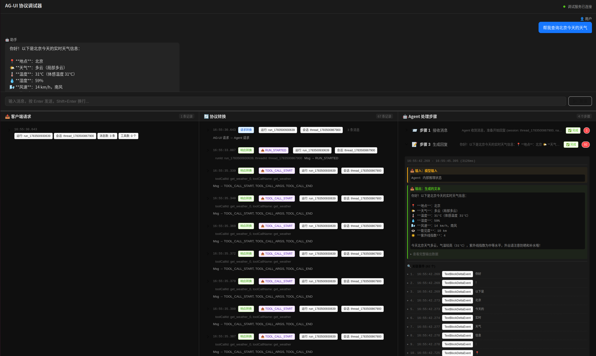
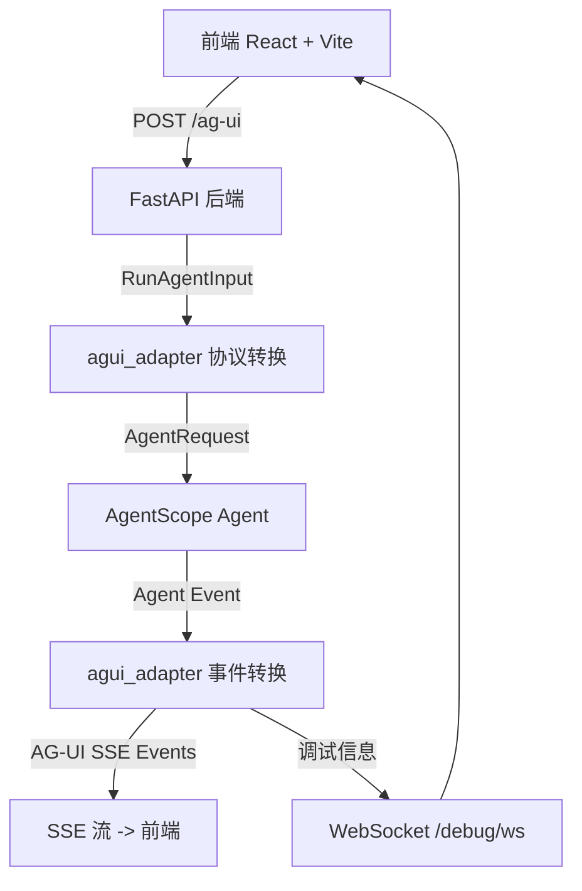

<div align="center">

# AG-UI 协议调试器

**从零手搓 AG-UI 协议栈 · 把 Agent 内部黑盒变成可观测的三栏调试台**

[](https://github.com/dddd1127/ag_ui_debug/actions/workflows/test.yml)
[](https://www.python.org/)
[](https://fastapi.tiangolo.com/)
[](https://react.dev/)
[](https://www.typescriptlang.org/)
[](#一键启动-docker)
[](LICENSE)

🚀 **[在线 Demo](#在线-demo)** ｜ 📺 **[演示录屏](#演示录屏)** ｜ 🔧 **[一键本地运行](#一键启动-docker)**

</div>

---

## 这是什么

大模型 Agent 应用跑起来后,有个绕不开的痛点:**Agent 内部到底发生了什么?** 工具调用、流式文本、协议转换--这些过程藏在后端日志里,前端只看到最终结果,调试时两眼一抹黑。

这个项目从零实现了一套 **AG-UI 协议兼容服务 + 三栏可视化调试台**:

- **后端**:独立用 FastAPI 实现 AG-UI 协议端点,把 agentscope ReActAgent 的内部消息流,**逐事件**转换成 AG-UI 标准事件,通过 SSE 流式吐给前端。
- **前端**:聊天界面 + 三栏调试面板,实时展示"客户端原始请求 / 协议双向转换 / Agent 内部事件"的全过程。

**一句话**:把 Agent 的黑盒拆开给你看,而且是用标准协议(AG-UI)拆的,不是 hack。

---

## 在线 Demo

> 🚧 部署中,链接即将上线(使用 Mock Agent 模式,无需 API Key 即可体验完整流程)。

如果暂时无法访问在线版,直接看下方录屏,或本地一键启动(30 秒):

```bash
docker-compose up --build   # Mock 模式,无需任何配置
# 打开 http://localhost:8090
```

---

## 演示录屏



**上半部分**是聊天界面,与 Agent 正常对话;**下半部分**是三栏调试面板,实时观察:

- **左栏**:客户端发出的原始 JSON 请求(`RunAgentInput`)
- **中栏**:AG-UI 协议与 agentscope 消息的**双向转换**(字段怎么映射、增量 delta 怎么算)
- **右栏**:Agent 内部事件(文本流、工具调用开始/参数/结果、状态变化)

> 📺 录屏 GIF 即将补充(展示天气查询触发工具调用的完整事件流)。

---

## 为什么做这个(技术价值)

这不是"调个 API 包个页面"的项目,核心是**协议工程**:

1. **协议层与业务层解耦**:`agui_adapter` 是纯协议转换层,不做增量计算;`agent_runner` 负责把 agentscope 的累积全量文本转成增量 delta。职责分离,转换器可独立复用到任何 Agent 框架。
2. **真实趟过的坑**:事件类型命名前后端不一致(SCREAMING_SNAKE vs CamelCase)导致 V2 通路静默失效;`ToolResultBlock.output` 可能是 list 不是字符串;客户端断开时 SSE 生成器的清理……这些 bug 都修过并沉淀成了规则。
3. **可观测性优先**:业务流走 SSE,调试流走独立 WebSocket,物理隔离不污染协议。调试面板看到的 delta 和业务流收到的是**同一份数据**,即"调试即真实"。

> 想了解每个技术决策的代码级 rationale,见 [`docs/`](docs/) 下的技术详解。

---

## 架构图


```mermaid
flowchart TD
    FE[前端 React + Vite] -->|POST /ag-ui| BE[FastAPI 后端]
    BE -->|RunAgentInput| ADAPTER1[agui_adapter 协议转换]
    ADAPTER1 -->|AgentRequest| AGENT[AgentScope Agent]
    AGENT -->|Agent Event| ADAPTER2[agui_adapter 事件转换]
    ADAPTER2 -->|AG-UI SSE Events| BE2[SSE 流 -> 前端]
    ADAPTER2 -->|调试信息| WS[WebSocket /debug/ws]
    WS --> FE
```

**数据流**:前端发请求 → adapter 转成 agentscope 消息 → ReActAgent 流式推理 → adapter 把内部消息逐事件转成 AG-UI 事件 → SSE 流式吐给前端 + WebSocket 同步推调试面板。

---

## 技术栈

| 层 | 技术 | 作用 |
|------|------|------|
| **后端** | FastAPI · Uvicorn · Pydantic | AG-UI 协议端点、SSE 流式响应、请求校验 |
| **Agent** | agentscope 1.x · ReActAgent | 工具调用、流式推理 |
| **协议** | ag-ui-protocol | AG-UI 事件类型定义 |
| **前端** | React 18 · TypeScript · Vite | 聊天界面 + 三栏调试面板 |
| **可视化** | Ant Design 5 · react-json-view · react-markdown | JSON 可视化、Markdown 渲染 |
| **工程** | Docker · GitHub Actions · pytest | 一键部署、CI 门禁、后端单测+集成测试 |

---

## 一键启动(Docker)

Mock Agent 模式,无需任何 API Key,**30 秒可见效果**:

```bash
git clone https://github.com/dddd1127/ag_ui_debug.git
cd ag_ui_debug
docker-compose up --build
# 打开 http://localhost:8090
```

Mock 模式使用本地事件回放,完整展示协议转换全流程。需要接真实大模型,见[接入真实模型](#接入真实模型可选)。

---

## 本地开发启动

<details>
<summary>展开:分别启动前后端(开发模式)</summary>

### 后端

```bash
cd ag_ui_debug/server
python -m venv .venv && source .venv/bin/activate
pip install -r requirements.txt

# Mock 模式(无需 API Key)
MOCK_AGENT=true python main.py

# 或真实模型模式
cp .env.example .env  # 编辑填入 ANTHROPIC_AUTH_TOKEN
python main.py
```

后端地址:`http://127.0.0.1:8090` · API 文档:`http://127.0.0.1:8090/docs`

### 前端

```bash
cd ag_ui_debug/web
npm install
npm run dev
```

前端地址:`http://localhost:5173`(已配置代理转发后端)

</details>

---

## 接入真实模型(可选)

默认 Mock 模式不调真实模型。接入大模型只需配置环境变量:

```bash
export ANTHROPIC_AUTH_TOKEN="your-api-key"
export ANTHROPIC_BASE_URL="https://opencode.ai/zen/go/v1"  # 可选
export ANTHROPIC_MODEL="kimi-k2.6"                          # 可选
```

已验证兼容 **Kimi (GLM)** 及任意 **Anthropic 兼容 API**。Agent 内置 `get_weather` 工具(调用 wttr.in 免费 API),支持中英文城市天气查询。

---

## 核心功能

### 1. AG-UI 协议端点(`POST /ag-ui`)

接收标准 `RunAgentInput`,返回 SSE 流式响应,覆盖完整事件类型:

```
RUN_STARTED → TEXT_MESSAGE_START → TEXT_MESSAGE_CONTENT → TEXT_MESSAGE_END
            → TOOL_CALL_START → TOOL_CALL_ARGS → TOOL_CALL_END → TOOL_CALL_RESULT
            → RUN_FINISHED / RUN_ERROR
```

### 2. 三栏调试面板

| 栏 | 内容 |
|---|---|
| 左栏 - Client JSON | 客户端发送的原始 `RunAgentInput` 请求 |
| 中栏 - AG-UI Transform | 协议双向转换过程(字段映射、增量 delta 计算) |
| 右栏 - Agent Info | Agent 内部事件(文本流、工具调用、状态变化) |

### 3. 协议转换可视化

**请求转换**:`RunAgentInput` → agentscope `Msg`(`threadId`→`session_id`、`runId`→`id`、role 映射、tool_calls → `ToolUseBlock`)

**响应转换**:agentscope `Msg` → AG-UI 事件(`Content(Text)`→`TEXT_MESSAGE_*`、`tool_use`→`TOOL_CALL_*`)

---

## 项目结构

```
ag_ui_debug/
├── server/                      # 后端:AG-UI 协议服务
│   ├── main.py                  # 入口(Uvicorn 启动)
│   ├── app.py                   # FastAPI 应用
│   ├── agui_endpoint.py         # POST /ag-ui 端点(SSE 流 + 断开清理)
│   ├── agui_adapter.py          # AG-UI ↔ agentscope 协议转换(核心)
│   ├── agent_runner.py          # Agent 运行 + 全量→增量 delta 计算(核心)
│   ├── debug_ws.py              # WebSocket 调试端点
│   ├── mock_agent_runner.py     # Mock 模式(无需 API Key 演示)
│   └── tests/                   # pytest 单测 + 集成测试
└── web/                         # 前端:可视化调试台
    └── src/
        ├── hooks/
        │   ├── useAguiSSE.ts    # AG-UI SSE 通信 Hook
        │   └── useDebugWS.ts    # WebSocket 调试连接 Hook
        └── components/
            ├── ChatPanel/       # 聊天界面
            └── DebugPanel/      # 三栏调试面板
```

---

## 测试

```bash
cd server
MOCK_AGENT=true pytest -v
```

覆盖:协议转换单元测试、SSE 端点集成测试、WebSocket 冒烟测试。CI(GitHub Actions)在每次 push/PR 自动运行后端测试 + 前端构建。

---

## 设计说明

<details>
<summary>为什么不用 agentscope 自带的 AgentApp 框架?</summary>

- **目标不同**:这个项目是为了**吃透 AG-UI 协议**,不是用框架。自己实现转换层才能看清每一步。
- **透明性**:调试面板要能看到协议转换的每一步,用框架的话转换逻辑被包起来了。
- **可复用**:转换器(`agui_adapter`)不依赖 `agentscope_runtime.engine` 框架代码,可独立复用到其他 Agent 框架。

</details>

<details>
<summary>为什么调试信息走独立 WebSocket,不复用 SSE 通道?</summary>

- **隔离**:SSE 通道跑的是 AG-UI 业务事件,前端 BlockReconstructor 在消费它。塞调试信息进去会污染协议。
- **独立性**:生产环境可关掉调试通道不影响业务;调试通道双向,前端还能发控制命令。
- **调试即真实**:调试面板看到的 delta 和业务流收到的是同一份数据(同一批 AG-UI 事件双路推送)。

</details>

---

## 扩展方向

- [ ] 增加更多工具(`search_web` / `calculator` / `execute_python_code`),支持多步 ReAct 推理
- [ ] Agent 效果评测闭环(准确率、工具调用成功率、平均步数)
- [ ] Session 持久化(Redis)+ 多用户并发支持
- [ ] 更多 AG-UI 事件(`REASONING_*` / `STATE_SNAPSHOT` / `STATE_DELTA`)

---

## License

MIT
